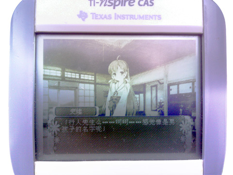

  

Nspire上的类ONS游戏引擎[KuroScripter](http://anderainlovelace.github.io/KuroScripterHome/)  
by Anderain Ryu (Hikari no Uiharu)
- - -
###关于###
KuroScripter是为Nspire系列计算器制作的文字类游戏引擎。  
底层使用SDL实现，在ndless上使用了SDL的实现nSDL。  
因为没有SDL Image的实现。在ndless SDK引用了libjpeg和SDL Image中的jpeg部分来读取jpeg。  
  
因为素材大小的缘故，移植时基本需要处理全部素材，加之需要删减不需要的命令以减少图形效果，所以设计时就打算没有兼容ONS的脚本。
  
此为[项目介绍主页](http://anderainlovelace.github.io/KuroScripterHome/)，含有移植游戏所需的脚本介绍。
- - -
###效果图###
*此为黑白机上Nspire Clickpad运行KRS的效果图*  
  
- - -
###开源###
依照BSD liscence开源